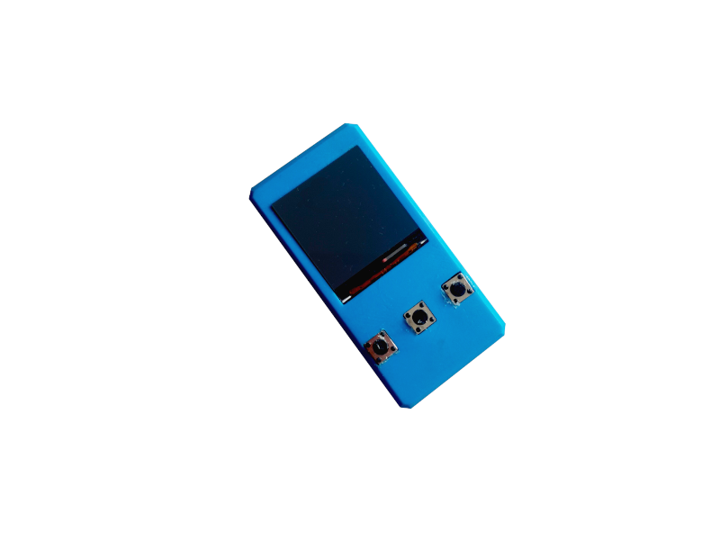

# ESP32 Keypass

# Your Passwords. In your pocket.

The ESP32 Keypass is a small device that stores all your passwords in a dry and save place, fully encrypted.

## Features

- State-of-the-art symmetric AES-128bit encryption
- secure passwords can be generated using custom wordlists for extra security
- keyboard emulation: Passwords can be typed via USB Keyboard emulation when connected through an USB cable or via bluetooth (bluetooth functionality currently unstable)
- import your passwords from other password managers
- securely export your encrypted data for backup measures
- store passwords and account names
- wide operating system support, even mobile ones through bluetooth

## Requirements

- An ESP32. You can use the -S2 variant so that you don't have to use an Arduino Pro Micro as a Keyboard Emulator, but you do give up bluetooth connectivity. Modification of the sketch is required for that variant to work at the moment.

- An Arduino Pro Micro. Used for USB Keyboard Emulation.

- If you choose to use - as I did - the 5v variant of the Pro Micro you will need an UART level shifter that shifts the 3.3v output from the ESP to the 5v input of the Micro. You can build one yourself with a couple of transistors, but they are clunky and don't really fit into the case. As there is no data flowing from the Micro to the ESP, an unidirectional level shifter is sufficient.

- A TFT display. In theory, you can use any display you like, I designed this specifically for the 240x240 px 1.3" tft display with the ST7789 controller. See section Modifications for more.

- 3 push buttons

- some wiring, I'm using 0.22mm². Using thin gauge wire will save you some hassle, trust me. **Note: Some thicker wire is appearently needed for power connection from the Micro to the ESP, otherwise the voltage becomes unstable and triggers the brownout detector.** 

- a 3d printer to print the case (not strictly necessary)

## Software Setup

This process is relatively straight forward.

1. Clone this repo:

    ~~~
    git clone https://github.com/atomicalbatross/Keypass
    ~~~
        
2. Prepare your Arduino environment. Download the arduino ide and install the ESP32 board definitions. **I HIGHLY RECOMMEND THE STANDALONE NOT-WINDOWS-STORE VERSION!** See section software notes why. A quick search using the search engine of your choice reveals how to do that. Then, install the following libraries:

    - [AceButton](https://github.com/bxparks/AceButton) by bxparks 
    - [TFT_eSPI](https://github.com/Bodmer/TFT_eSPI) by Bodmer
    - [BleKeyboard](https://github.com/T-vK/ESP32-BLE-Keyboard) by T-vk 
  
    I included the required ESP_ST7789.h file needed by the TFT lib for specific configuration pin of the ESP32. **This file is only configured for the ST7789 display driver on the ESP!** Copy that into

    ~~~
    Arduino library folder/TFT_eSPI/User_Setups/
    ~~~

    and insert

    ~~~
    #include "User_Setups/ESP32_ST7789.h"
    ~~~

    at the top of 

    ~~~
    Arduino library folder/TFT_eSPI/User_Setup.h
    ~~~

    **Make sure that everything else in User_Setup.h file is commented out!**

    By default, this sketch uses the NimBLE bluetooth stack. You don't have to use that mode, but I strongly recommend you do. Install this lib then:

    - [NimBLE](https://github.com/h2zero/NimBLE-Arduino) by h2zero
    
    To finish the software side of the setup, download the [esp32-Encrypt helper functions](https://github.com/josephpal/esp32-Encrypt) by josephpal. Copy the file `src/Cipher.cpp` and `src/Cipher.h` into the main Keypass folder.

3. Finally, review the settings in the `config.h` file in the Keypass folder. See included comments for a detailed explanation of what certain defines do.

4. Flash the ESP32.

5. Flash the Arduino Micro with the `SerialKeyboardBridge/SerialKeyboardBridge.ino` file.

6. For more information review the Software Notes section. **A user manual describing how to use the device will come online shortly!**

## Hardware Setup

1. Print the included files `stl/KeypassBody.stl` and `stl/KeypassBottom.stl` using your 3d printer. .2 layer height is sufficient.
    
2. Wiring:
    
    - See the tables for reference. Note that the pins used for button input can be changed to your liking. Also note that you **cannot** use a different Serial output other than Serial2 on pins 16 and 17 due to ESP limitations. If you plan to use my case, I recommend that you solder the wires onto the back of the display so that you can glue it into the case without any problems.
    
    **Display connections (only applicable for the particular display used here):**
    

    | Display Pin | ESP Pin |
    |----|----|
    | MISO | 19 |
    | MOSI | 23 |
    | SCLK | 18 |
    | DC | 2 |
    | RST | 4 |
        
        
    **Power connections:**
    

    | Pin on ESP32 | Device | Pin on that device |
    |----|----|----|
    | 5V | Arduino Micro | 5V (use thicker wires here) |
    | GND | Arduino Micro | GND (use thicker wires here) |
    | 5V | Level Shifter | Voltage High in |
    | 3.3V | Level Shifter | Voltage Low in |
    | GND | Level Shifter | GND on high side |
    | GND | Level Shifter | GND on low side |
        
    **Serial connections:**
    

    | Pin on ESP32 | Device | Pin on that device |
    |----|----|----|
    | 16 | Level Shifter | low side input |
    

    | Pin on Arduino Micro | Device | Pin on that device |
    |----|----|----|
    | RX1 | Level Shifter | high side output |
    
    **Button connections:**
    

    | Pin on ESP32 | Button |
    |----|----|
    | 25 (configurable) | Enter Button | 
    | 26 (configurable) | Down Button | 
    | 32 (configurable) | Up Button |
       
3. Glue the push buttons into the main chassis. Then solder them to the ESP. Glue the display into the chassis and connect it to the ESP. Place the ESP in the chassis and glue the level shifter on top of the metal casing. Connect both the Micro and the ESP to the level shifter. Finally, connect power wires. The bottom part of the body can be secured with double-sided tape.

## Software Notes

- Due to the nature of AES-128, an encryption key with at least a length of 16 chars is needed. This sketch allows you to use keys with a length smaller than that and chains them under hood to satisfy that requirement anyways. 
This is not very secure as it might reduce the resistance against brute-force attacks. For maximum security, always use keys with 16 chars. The encryption key is the pin you have to enter to unlock the device.

    **The pin itself is not stored on the device and can't be recovered if you forget it. All your data is then inaccesible!**

- A secret but hard-coded reset-pin can be used to clear all saved data even when the device is locked. Pin configurable within the `config.h`.
    
    **There is no confirmation prompt whatsoever that asks if you really want to delete everything! It simply does and starts the first-time-setup process.**
    
- You can import passwords from your existing password manager. 
  
    1. Export your passwords in clear text or csv format.
    2. In order for to be correctly read by the manager, the data has to be in the following format:
        
        ~~~
        name|username|password,name|username|password
        ~~~
        
        **Example:**
        
        ~~~
        Github|testaccount|mysupersecretpassword,Gitlab|testaccount|mysupersecretpassword2,
        ~~~
            
        Each entry has to be seperated by a comma. Make sure that the very last entry is closed by a comma.
        
    3. Install the ESP32 sketch data uploader in your Arduino IDE. **If you are using the Windows-Store-Version of the Arduino IDE, although technically possible, you cannot install external tools like this one. Use the standalone version instead.**
    In the `Keypass/encrypt_file` folder, copy the text file you just created into the `data` folder an rename it to `data.txt`.
        
    4. Open the `encrypt_file/encrypt_file.ino` sketch, adjust the values for the defines to match those in your `config.h` file. Change the KEY define to the key you want to use.
    Then, use Tools > Upload ESP32 sketch data from the main menu to generate and upload the SPIFFS image. Finally, upload the sketch and let it run. You will see "DONE!" printed on the Serial Monitor at baud 115200. Upload the main `Keypass.ino` sketch and check if everything worked es intended.

## Security Considerations

As always, a device is just as secure as the most vulnerable link in its security chain. Keep the following things in mind:

- This device might be a little more secure than the average password manager just because it does not go online, but despite that, it is still prone to soft- and hardware keyloggers installed on your computer.
    
- Bluetooth communication might seem convinient, but as it is a wireless protocol, data can be spoofed more easily than when using an cable connection. As far as I am concerned, the wireless keyboard data is not encrypted in the current implementation of the BLEKeyboard lib. Just use an USB cable that you need to power the device anyways.
    
- The included default wordlist is not secure (because it is public and only contains english words), generate your own and store them in the `Words.h` file. Special chars apart from | and , are allowed, including numbers.
    
- Remember that when using numbers as the pin to unlock the device, the strength of the encryption key decreases a lot. Brute force attacks now only have to go through 10the length of your pin instead of 26the length of your pin.
    
- You can - if you want to - encrypt flash storage, see [here](https://docs.espressif.com/projects/esp-idf/en/latest/esp32/security/flash-encryption.html) for more details. As the encryption key is not hardcoded, there is not really a reason to do this, other than to keep the wordlist private.
    
- While the device is powered on and unlocked the passwords are stored in RAM as plain text. An attacker could dip your unlocked Keypass into liquid nitrogen and freeze the memory to then later read the contents of it. Decide by yourself how likely this attack vector seems to be for you.

## Possible Modifications

You can - of course - use different displays and microcontrollers. While some mods might be a little more tedious to implement, using a different display than that being used here is possible with little effort - if the TFT library supports the display driver. See [this](https://github.com/Bodmer/SPI_eTFT) repo for supported drivers. Keep in mind that different screens may have different resolutions, so that some values in the `config.h` file need to be tweaked to match your particular setup. Screens other than the one used here are not tested.

## Acknowledgements

This projects uses the following libraries:

- [SPI_eTFT](https://github.com/Bodmer/TFT_eSPI) lib by Bodmer, licensed under a MIT/BSD License
- [Cipher helper functions](https://github.com/josephpal/esp32-Encrypt) by josephpal, which makes use of the mbed tls library. See his repo for more details.
- The [BLEKeyboard](https://github.com/T-vK/ESP32-BLE-Keyboard) lib by T-vk, and the NimBLE lib under the hood. See the repos for their respective licenses.

## Disclaimer

I am not responsible for any data that got lost or deleted while using this device. Always make an encrypted backup of your important data and store it in a save place. If your device gets hacked or stolen and all of your passwords are gone, that's your problem, not mine. Use at your own risk.

## License
~~~
Copyright 2022 AtomicAlbatross

Redistribution and use in source and binary forms, with or without modification, are permitted provided that the following conditions are met:

1. Redistributions of source code must retain the above copyright notice, this list of conditions and the following disclaimer.

2. Redistributions in binary form must reproduce the above copyright notice, this list of conditions and the following disclaimer in the documentation and/or other materials provided with the distribution.

3. Neither the name of the copyright holder nor the names of its contributors may be used to endorse or promote products derived from this software without specific prior written permission.

THIS SOFTWARE IS PROVIDED BY THE COPYRIGHT HOLDERS AND CONTRIBUTORS "AS IS" AND ANY EXPRESS OR IMPLIED WARRANTIES, INCLUDING, BUT NOT LIMITED TO, THE IMPLIED WARRANTIES OF MERCHANTABILITY AND FITNESS FOR A PARTICULAR PURPOSE ARE DISCLAIMED. IN NO EVENT SHALL THE COPYRIGHT HOLDER OR CONTRIBUTORS BE LIABLE FOR ANY DIRECT, INDIRECT, INCIDENTAL, SPECIAL, EXEMPLARY, OR CONSEQUENTIAL DAMAGES (INCLUDING, BUT NOT LIMITED TO, PROCUREMENT OF SUBSTITUTE GOODS OR SERVICES; LOSS OF USE, DATA, OR PROFITS; OR BUSINESS INTERRUPTION) HOWEVER CAUSED AND ON ANY THEORY OF LIABILITY, WHETHER IN CONTRACT, STRICT LIABILITY, OR TORT (INCLUDING NEGLIGENCE OR OTHERWISE) ARISING IN ANY WAY OUT OF THE USE OF THIS SOFTWARE, EVEN IF ADVISED OF THE POSSIBILITY OF SUCH DAMAGE.
~~~